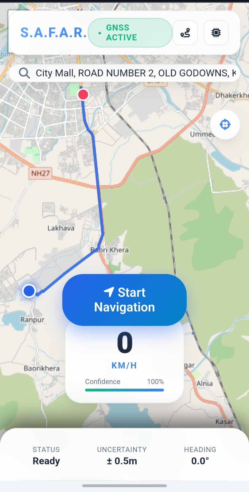

# S.A.F.A.R. (TrueTrack)

**AI-assisted Inertial Dead Reckoning for GNSS-denied vehicle navigation**

Built for **Smart India Hackathon — Problem Statement ID 25168 (ISRO / Department of Space)**: *"AI/ML based intelligent Dead Reckoning mechanism for seamless navigation of a vehicle in a GNSS denied environment."*



---

## Overview

Vehicle navigation apps break down the moment GPS/GNSS signal is lost — inside tunnels, in dense urban canyons, under multi-level flyovers, or in valleys and forested terrain. **S.A.F.A.R.** (backend codename `TrueTrack`) keeps a vehicle's position estimate alive through exactly these blackouts by fusing:

- **Smartphone inertial sensors** — accelerometer, gyroscope, and gravity vector (no external hardware required), and
- **A trained AI velocity model** that regresses vehicle speed from windowed IMU features (learned from real CAN-bus speedometer data), feeding

into an **Extended Kalman Filter (EKF)** that continuously reconciles GNSS fixes (when available) with the inertial + AI-predicted motion estimate, and gracefully hands off between them.

The result is a position estimate that degrades gracefully — not catastrophically — when satellite lock is lost, and re-locks smoothly the moment GNSS returns.

## Why this approach

Naive dead reckoning (double-integrating raw accelerometer readings) drifts rapidly — errors compound quadratically with time and a stationary phone's own sensor bias alone can produce large position errors within a minute. S.A.F.A.R. instead:

1. Learns vehicle speed directly from phone motion patterns using a model trained on **real vehicle trips (IO-VNBD dataset)**, correlating smartphone IMU signatures with the vehicle's actual CAN-bus/OBD-II speedometer reading — at inference time, **only the phone's own sensors are used**, never the vehicle bus.
2. Feeds that AI speed estimate into an EKF alongside gyroscope heading and (when present) GNSS position/velocity, rather than trusting raw integration alone.
3. Explicitly models the transition between navigation states, rather than treating "GNSS available" and "GNSS lost" as a hard switch.

## How it works

### Navigation state machine

The fusion engine moves through explicit states rather than a binary GPS-on/GPS-off flag:

```
GNSS_LOCKED → GNSS_WEAK → TRANSITION → GNSS_DENIED → RECOVERING → RELOCKED
```

This avoids the two failure modes of a hard switch: a sudden position jump when GNSS is regained after a long outage, and full trust in a single noisy GPS fix right at the edge of signal loss.

### Sensor fusion pipeline

| Stage | What it does |
|---|---|
| **Frame transform** | Rotates raw phone-frame acceleration into a vehicle-aligned frame (forward / lateral / vertical) using the live gravity vector, so orientation of the phone in the vehicle doesn't matter. |
| **AI velocity model** | A `HistGradientBoostingRegressor` (scikit-learn) predicts vehicle speed from a sliding window of accelerometer, gravity, and gyroscope features — trained to reproduce the real speedometer reading without ever seeing it at inference time. |
| **Extended Kalman Filter** | An 8-state EKF (`position × 2, velocity × 2, heading, gyro bias, accel bias × 2`) fuses the AI speed estimate, gyroscope heading, and GNSS fixes (position + Doppler speed) when available, tracking its own uncertainty throughout. |
| **Confidence scoring** | A continuous 0–100% confidence score is derived from GNSS accuracy, filter covariance, motion state, and time-since-last-fix, and shown live to the driver. |

### Two operating modes

- **Replay mode** — steps through a real, held-out trip from the IO-VNBD dataset with a simulated GNSS blackout, plotting ground truth vs. naive double-integration vs. the AI-fused estimate side by side. Lets the system be demoed and evaluated indoors, without a moving vehicle — as suggested by the problem statement itself.
- **Live mode** — takes real accelerometer / gyroscope / gravity / GPS samples from a phone's browser (via the Web Motion and Geolocation APIs) and fuses them in real time, with an operator-toggleable simulated GNSS outage for live demonstration.

## Screenshot walkthrough

The screenshot above shows the live navigation view:

- **GNSS ACTIVE** badge — current lock state from the navigation state machine.
- **Route line** — planned route to the searched destination, with the live position marker at the vehicle's current fused location.
- **Speed** — current speed in km/h, from GNSS Doppler when locked or the AI velocity model when GNSS-denied.
- **Confidence bar** — the live 0–100% fusion confidence score.
- **Status strip** — filter status, current position uncertainty (± meters), and heading, all sourced from the EKF state and covariance.

## Tech stack

| Layer | Technology |
|---|---|
| Backend | Python, [FastAPI](https://fastapi.tiangolo.com/), Uvicorn |
| Sensor fusion | NumPy, hand-rolled Extended Kalman Filter |
| AI model | scikit-learn `HistGradientBoostingRegressor`, joblib |
| Data processing | pandas |
| Frontend | HTML / CSS / vanilla JS, [Leaflet](https://leafletjs.com/) for mapping |
| Training data | [IO-VNBD](https://github.com) — synchronised smartphone-IMU + vehicle-CAN-bus driving trips |
| Deployment | Render (Blueprint / `render.yaml`), Python 3.12 |

## Project structure

```
app/                    FastAPI application, fusion engine, trained model
  main.py               API routes (health, replay, live sessions)
  fusion.py             Frame transforms, confidence scoring, AI-fused dead reckoning
  ekf.py                Extended Kalman Filter implementation
  data_utils.py          IO-VNBD loading + windowed feature engineering
  geo.py                Local ENU (meters) <-> lat/lon projection
  model.py              Lazy, thread-safe loader for the trained model
  replay.py             Precomputed ground-truth / naive / AI-fused trajectories for demo trips
  replay_data/          Bundled demo trip CSVs (required at runtime)
  trained_model.joblib  Trained AI velocity model
static/                 Leaflet-based frontend (index.html, app.js, style.css)
train_model.py          Retrains the AI velocity model from IO-VNBD trips
offline_eval.py         Batch evaluation of blackout drift -> drift_comparison.png
requirements.txt        Production dependencies
requirements-dev.txt    Additional dependencies for training/evaluation
render.yaml / Procfile  Render deployment configuration
```

## Getting started

### Prerequisites

- Python 3.12
- pip

### Local setup

```bash
python -m venv .venv
source .venv/bin/activate          # Windows: .venv\Scripts\activate
pip install -r requirements.txt
uvicorn app.main:app --reload --port 8000
```

Then open **http://localhost:8000/**.

> **Note:** Live mode reads the phone's motion and geolocation sensors through the browser, which browsers only expose over HTTPS or on `localhost` — it will not work over plain HTTP on a LAN IP.

### Training / evaluation (optional)

```bash
pip install -r requirements-dev.txt
python train_model.py     # retrains and overwrites app/trained_model.joblib
python offline_eval.py    # produces drift_comparison.png
```

If you retrain the model, commit the regenerated `app/trained_model.joblib`, and make sure the pinned `numpy` / `scikit-learn` versions in `requirements.txt` still match the versions used for training.

## API reference

| Method | Endpoint | Purpose |
|---|---|---|
| `GET` | `/api/health` | Liveness probe |
| `GET` | `/api/replay/trips` | List bundled demo trips |
| `POST` | `/api/replay/{trip_id}/start` | Start a replay session |
| `POST` | `/api/replay/session/{sid}/next` | Advance the replay by one 100 ms step |
| `POST` | `/api/live/session/start` | Start a live sensor-fusion session |
| `POST` | `/api/live/session/{sid}/sample` | Submit one live IMU(+GPS) sample, receive the fused position |

## Deployment

The repository is pre-configured as a **Render Blueprint**:

1. Push this folder to the root of a GitHub repository.
2. In Render: **New → Blueprint**, and select the repository — it reads `render.yaml` automatically.
3. Deploy. Health checks run against `GET /api/health`.

Once live, the frontend is served at `/` and the API under `/api/...`.

**Two constraints that must be preserved:**

- **Do not downgrade `numpy` or `scikit-learn`** below the versions pinned in `requirements.txt` — the committed model was trained on `numpy 2.x` / `scikit-learn 1.8.x`, and older versions cannot unpickle it.
- **Keep `--workers 1`.** Replay and live sessions are held in per-process memory; a second worker would return `404` for roughly half of all requests.

## Roadmap

- Package the web app as a native mobile app via [Capacitor](https://capacitorjs.com/) for on-device sensor access without a browser.
- Expand the AI velocity model's training set beyond the current held-out IO-VNBD trips.
- Add persistent session storage to support horizontal scaling beyond a single worker.

## Acknowledgements

- **IO-VNBD** dataset for synchronised smartphone-IMU and vehicle-CAN-bus driving trips used for training and evaluation.
- Built in response to **ISRO / Department of Space**, Smart India Hackathon **Problem Statement ID 25168**.